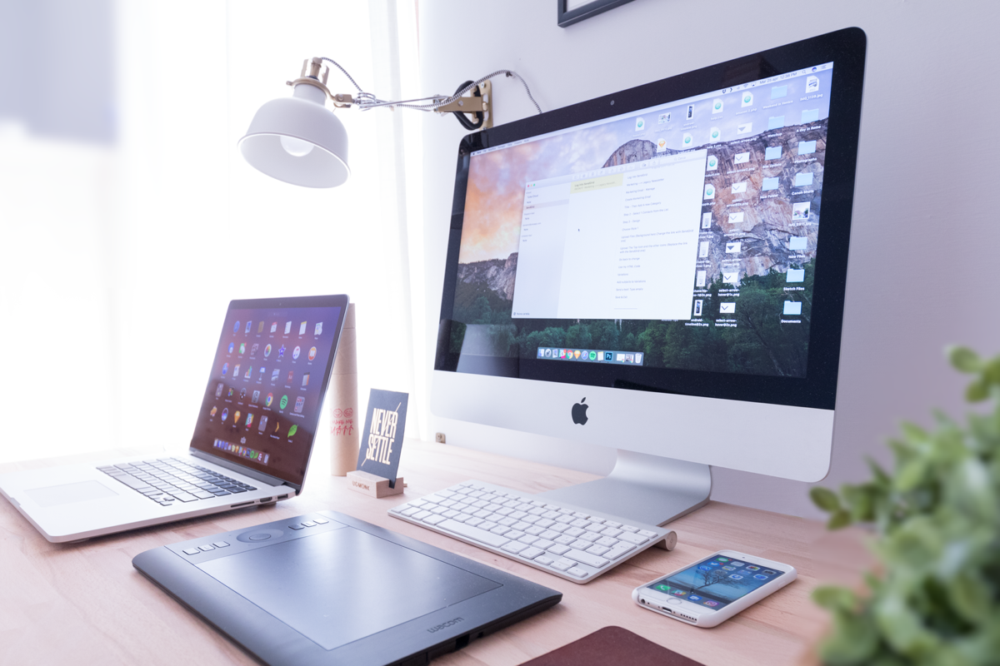
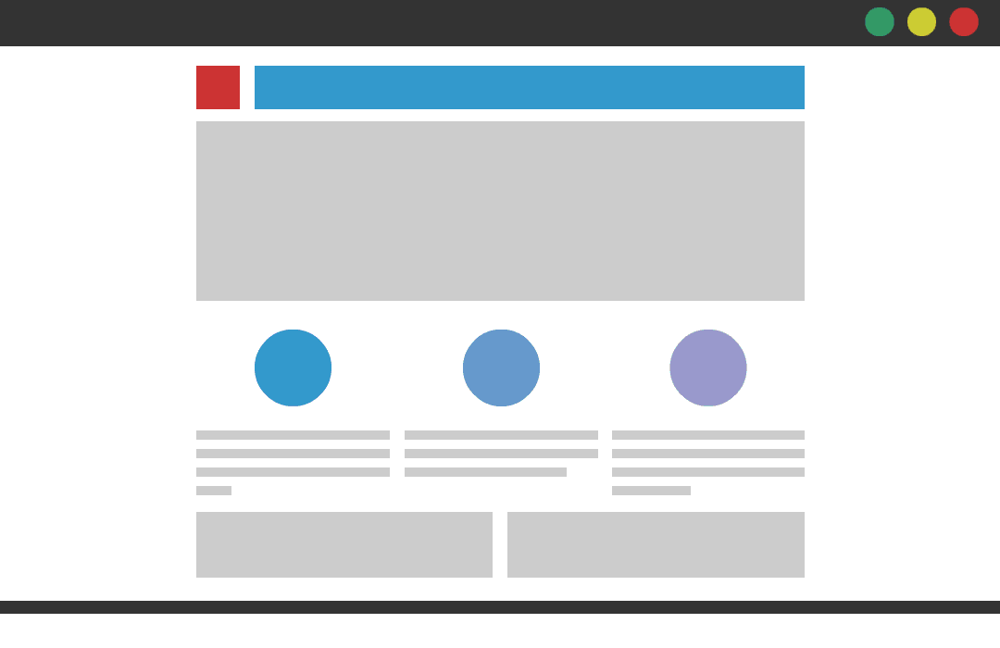
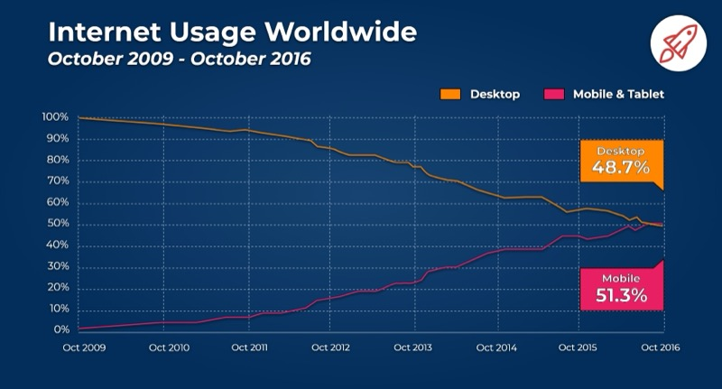
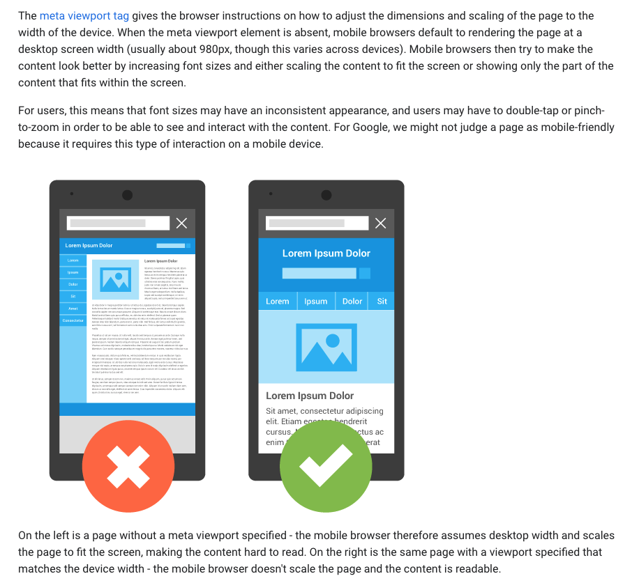
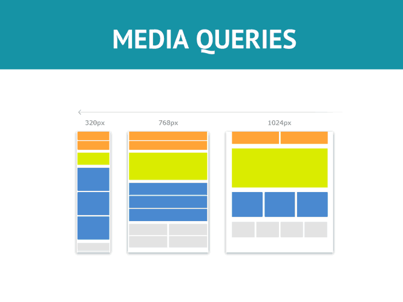
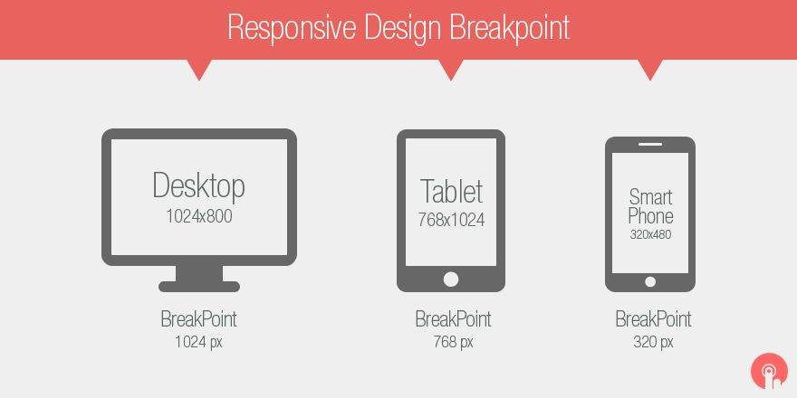
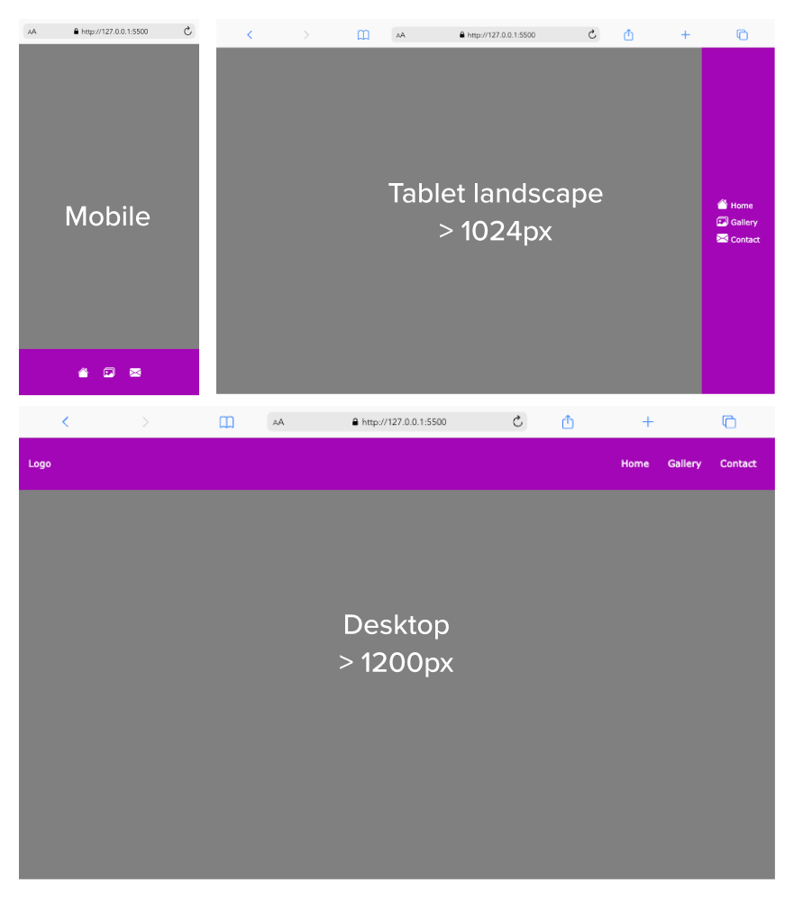

## Objectifs

* Comprendre ce que sont les *media queries*
* Découvrir comment tu peux les utiliser pour modifier ta mise en page
* Comprendre le concept du **mobile first**

## Introduction

Aux débuts d'Internet, les pages web étaient conçues pour des tailles d'écran très spécifiques.
Aujourd'hui, **nous avons tous des tailles d'écran différentes**, même nos **smartphones sont tous de tailles différentes**.

C'est pour résoudre ce problème spécifique que le *responsive web design* (design web réactif) a été inventé.
Le *responsive web design* **est un ensemble de pratiques** qui **permet aux pages web de changer leur mise en page pour s'adapter à des tailles d'écran différentes**.

Dans cette ressource, nous parlerons de ce qu'est le *responsive web design* et **de la façon dont tu peux appliquer ces pratiques à tes sites web**.



## L'histoire des différentes mise en page des sites web

Avant que le concept de sites web réactifs n'existe, il n'y avait que deux façons de concevoir un site web.

* Créer une mise en page fixe (les sites web ont une taille fixe)


* Créer une mise en page **liquide** (les sites web ont une taille en % qui s'adapte à la largeur de l'écran)


Source:[https://medium.com/@space.alpaca/so-what-exactly-is-the-difference-between-fixed-fluid-adaptive-and-responsive-layouts-and-why-3773272d8481](https://medium.com/@space.alpaca/so-what-exactly-is-the-difference-between-fixed-fluid-adaptive-and-responsive-layouts-and-why-3773272d8481)

Le *responsive design* a été créé pour résoudre les problèmes des dispositions fixes et liquides.

## Responsive Design

Le terme "*responsive design*" (conception réactive ou adaptative) **ne se réfère pas à une technologie spécifique**. Il fait plutôt référence à un **ensemble d'outils et de pratiques pour créer des mises en page** qui "s'adaptent" à la **taille des écrans**.
Le terme "*responsive design*" a été apposé par Ethan Matcotte en 2010.


## Mobile-first

Un concept qui est également apparu avec le *responsive design* (et surtout à la "révolution mobile") est le concept de **mobile-first.**

La philosophie du *mobile-first* est de toujours commencer à travailler sur la version **mobile avant de construire la version de bureau.**

Non seulement les utilisateurs **auront une meilleure expérience sur mobile**, mais **il est également plus facile de commencer à travailler sur une version mobile.**

>**Illustrons ce concept**.
>Imagine que tu vives dans une petite pièce (quelques mètres carrés). Si tu dois déménager dans un appartement plus grand, il te sera bien plus facile de déplacer toutes tes affaires depuis un espace plus petit vers un espace plus grand que l'inverse.

C'est la même chose pour le **design réactif.**

La plupart des utilisations d'Internet se font à partir d'un appareil mobile, il est donc crucial d'avoir une excellente version mobile de ton site web !


*source:* [https://www.broadbandsearch.net/blog/mobile-desktop-internet-usage-statistics](https://www.broadbandsearch.net/blog/mobile-desktop-internet-usage-statistics)

Aujourd'hui, avoir une **bonne version mobile** peut **améliorer considérablement la visibilité sur les moteurs de recherche.**
Par exemple, **Google donnera un rang à ton site web** en vérifiant si celui-ci est **mobile-friendly** et lui attribuant si c'est le cas **une meilleure visibilité sur le moteur de recherche.**

<div class="alert-info" markdown="1">
[Adaptabilité au téléphone portable](https://developer.mozilla.org/en-US/docs/Web/Guide/Mobile/Mobile-friendliness)
Un bel article de MDN sur l'adaptabilité des sites aux téléphones portables
</div>

## Comment coder une page web responsive

### La balise meta viewport

Pour indiquer au navigateur que ta page s'adapte à tous les appareils, tu dois ajouter une balise *meta* dans le `<head>` de ton document :

```html
<head>
  <meta name="viewport" content="width=device-width, initial-scale=1.0">
</head>
```

Ici, nous indiquons au navigateur d'utiliser 100% de la largeur disponible de l'écran et d'appliquer un niveau de grossissement à 1 (c'est-à-dire pas de zoom avant ni arrière).

<div class="alert-info" markdown="1">
[Utilisation de la balise meta viewport](https://developer.mozilla.org/fr/docs/Web/HTML/Viewport_meta_tag)
</div>


*Source:* [https://developers.google.com/search/mobile-sites/mobile-seo/responsive-design](https://developers.google.com/search/mobile-sites/mobile-seo/responsive-design)

### Media queries

Les *media queries* permettent de modifier la mise en page en fonction de la taille du **viewport**.
Ce que nous appelons viewport est **la taille de la fenêtre**.

En utilisant les *media queries*, tu peux décider de réorganiser certains éléments de ta page web en fonction de la taille de la fenêtre.


*Source:* [https://hackernoon.com/introduction-to-css-media-queries-xu3t3vxc](https://hackernoon.com/introduction-to-css-media-queries-xu3t3vxc)

La syntaxe d'une *media query* ressemble à ceci :

```css
@media <media_type> and (<media_features>) {

/* put your CSS here */

}
```

### Types de *media*

Le `<media_type>` décrit la catégorie d'appareil. Voici une liste des différents **types de media** que tu peux utiliser :

* `all` : appliquer la règle à tous les types d'appareils.

* `print` : utilisé pour un document destiné à être imprimé (papier)

* `screen` : utilisé pour tous les types d'écran.

* `speech` : pour les synthétiseurs de parole

Le **plus utilisé** est généralement `screen`.

### Caractéristiques media

Ensuite, à la place de `<media_features>`, tu peux écrire des règles pour lesquelles la media query sera appliquée.
Les *features* les plus courantes sont la largeur minimale `min-width` et la largeur maximale `max-width`.

Tu peux trouver une liste complète sur le site w3schools :

<div class="alert-info" markdown="1">
[CSS @media Rule](https://www.w3schools.com/cssref/css3_pr_mediaquery.asp)
Tu trouveras ici la définition et les règles d'utilisation des *media queries*
</div>

Voici un exemple de *media queries* avec toutes les propriétés :

```css
@media screen and (max-width: 600px) { 
  .menu { 
    display: none; 
  } 
}

//écriture alternative 
@media screen and (width <= 600px) { 
  .menu { 
    display: none; 
  } 
}
```

Cette *media query* vérifie si la page web est affichée sur un écran, et si la largeur de la fenêtre de visualisation est inférieure à **600px.**
Si la condition est vraie, alors la règle CSS est appliquée et l'élément `.menu` change en `display : none.`

Ouvre la démo sur Codesandbox et déplace la taille de l'écran ; le menu devrait disparaître lorsque la taille de l'écran est inférieure à **600px**.

[Codesandbox - Media query demo](https://codesandbox.io/s/restless-waterfall-do0wo?file=/style.css:192-195)

Il existe plein d'autres options possibles pour spécifier certaines situations telles que l'**orientation portrait ou paysage** du média (orientation), **la résolution**, si le type d'**affichage est monochrome**, etc. Consulte la page suivante pour des explications détaillées.

<div class="alert-info" markdown="1">
[Les media features](https://developer.mozilla.org/fr/docs/Web/CSS/CSS_media_queries/Using_media_queries#caract%C3%A9ristiques_m%C3%A9dia_media_features)
</div>

**🔬 Expérience**

Maintenant, essaie de réarranger ces trois blocs en utilisant les *media queries*. Lorsque la taille de l'écran est inférieure à 600px, les blocs doivent être en `display:block` et prendre toute la largeur (100%).

[Codesandbox - Exercice media queries](https://codesandbox.io/s/zen-keldysh-ol0g9?file=/style.css)

<details>
<summary>Voir la solution</summary>

Des difficultés pour trouver la solution? Persévère, tu vas y arriver

```css
@media screen and (max-width: 600px) {
  .boxes {
    display: block;
    width: 100%;
  }
}
```

</details>

## Points de rupture

Dans la *responsive design*, un point de rupture (ou *breakpoint*) est un point auquel la *media query* se déclenche (et la mise en page s'adapte). Dans l'exemple précédent, tu as utilisé 600px comme point de rupture.

Nous ne voulons pas que les éléments changent tout le temps pour un grand nombre d'écrans différents.
Ton site web ne devrait changer que sur les **points d'arrêt** principaux (ex : lorsque le site passe d'un écran de bureau à la tablette, *etc.*)

Voici les tailles d'écran les plus utilisées :

* **Mobile en portrait** (320px à 414px) - Pour les appareils avec des écrans de 4" à 6,9".
* **Mobile en paysage** (568px à 812px) - Idem, mais en paysage.
* **Tablette en portrait** (768px à 834px) - Pour les appareils de 7" à 10".
* **Tablette en paysage** (1024px à 1112px) - Idem, mais aussi tablettes 12" en portrait.
* **Ecrans d'ordinateurs portables et de bureau** (>1200px) - Varie beaucoup, mais généralement de 1200px et plus.


*Source : Pinterest* [https://in.pinterest.com/pin/370421138093022328/](https://in.pinterest.com/pin/370421138093022328/)

## Images

Un autre concept important en *responsive design* est celui des **images**.
Nous voulons aussi que les images s'adaptent à la taille de l'écran.

Nous pouvons utiliser ce code pour nous assurer que l'élément image ne prend pas plus de 100% de la taille du parent :

```css
img {
  max-width: 100%;
  height: auto;
}
```

**🔬 Expérience**

Cette image de chat est trop grande : utilise la technique que nous venons d'apprendre pour l'adapter à la taille de la fenêtre de visualisation.

[Codesandbox - Exercice images](https://codesandbox.io/s/agitated-vaughan-75xsr)

<details>
<summary>Voir le code</summary>

Des problèmes pour trouver la solution ?

```css
.img-cat {
  max-width: 100%;
  height: auto;
}
```

</details>

## Résumé

* Le *responsive design* est un **ensemble de pratiques** utilisées pour **créer une mise en page qui "répond" (s'adapte) aux contraintes de l'appareil**
* Le principe du ***mobile-first*** est un principe important lié au *responsive design*. Ce principe signifie que tu dois toujours **démarrer la construction de la version mobile** de ton site web **avant la version pour bureau**
* Tu peux écrire des *media queries* pour appliquer des **règles CSS spécifiques** à certaines **tailles d'écran**

## Ressources

<div class="alert-info" markdown="1">
[Responsive design - Meilleures pratiques et considérations](https://www.toptal.com/designers/responsive/responsive-design-best-practices)
Un bel article sur les meilleures pratiques en matière de *responsive design*.
</div>

## Challenge

En utilisant les *media queries*, essaie de reproduire l'intégration de la barre de navigation représentée ci-dessous.



### Consignes

- L'intégration doit être faite pour trois tailles d'écran, soit deux points de ruptures (1024 et 1200px), comme suit :
  - **Mobile portrait ou paysage** pour une largeur inférieure à 1024px. Servira aussi pour les tablettes en orientation portrait.
  - **Tablette en orientation paysage** et une largeur d'écran supérieure à 1024px
  - **Ordinateur** et une largeur supérieure à 1200px
- Pour les trois versions, la barre de navigation est fixe.
- Version **mobile** : seules les icônes sont visibles. La barre est fixée en pied de fenêtre
- Version **tablette** : les icônes ainsi que les textes des liens sont visibles. La barre est fixée à droite de l'écran
- Version **ordinateur** : les icônes sont cachées mais les textes des liens sont visibles ainsi que le logo. La barre de navigation est fixée en haut de la fenêtre.

### Tips
- Essaie de réaliser ton CSS dans une approche _**mobile first**_
- Code pour le violet : #A306B6.
- Icônes : tu peux utiliser la [bibliothèque d'icônes Bootstrap Icons](https://icons.getbootstrap.com/) qui s'intègre en ajoutant ce code dans la partie `<head>` de la page :

```html
<link rel="stylesheet" href="https://cdn.jsdelivr.net/npm/bootstrap-icons@1.11.3/font/bootstrap-icons.min.css">
```

### Solution pas à pas


- **Démarrage**

Je crée les fichiers `index.html` et `style.css` dans un dossier approprié.

- **HTML**

Je pose l'ensemble des éléments HTML dont je vais avoir besoin pour les trois versions.

```html
<!DOCTYPE html>
<html lang="en">

<head>
    <meta charset="UTF-8">
    <meta name="viewport" content="width=device-width, initial-scale=1.0">
    <title>Exercise | Responsive</title>
    <link rel="stylesheet" href="style.css">
    <link rel="stylesheet" href="https://cdn.jsdelivr.net/npm/bootstrap-icons@1.11.3/font/bootstrap-icons.min.css">
</head>

<body>
    <nav>
        <a href="#" class="logo">Logo</a>
        <ul>
            <li>
                <a href="#">
                    <i class="bi bi-house-fill"></i>
                    <span>Home</span>
                </a>
            </li>
            <li>
                <a href="#">
                    <i class="bi bi-images"></i>
                    <span>Gallery</span>
                </a>
            </li>
            <li>
                <a href="#">
                    <i class="bi bi-envelope-fill"></i>
                    <span>Contact</span>
                </a>
            </li>
        </ul>
    </nav>
</body>

</html>
```

**À noter** : l'utilisation des icônes bootstrap grâce aux tags `<i>`. Les textes des liens sont placés à l'intérieur de `<span>` pour pouvoir être manipulés via le CSS.

- **Mobile first**

Je réalise l'intégration de la vue mobile.

```css
* {
    box-sizing: border-box;
}

body {
    margin: 0;
    line-height: 1.5;
    background-color: grey;
    font-family: Verdana, Geneva, Tahoma, sans-serif;
}

nav {
    position: fixed;
    inset: auto 0 0 0;
    display: flex;
    justify-content: center;
    align-items: center;
    padding: 1rem;
    background-color: #A306B6;
    color: #fff;
}

nav>a.logo {
    display: none;
    color: inherit;
    text-decoration: none;
}

nav>ul {
    display: flex;
    list-style: none;
    padding: 0;
}

nav>ul>li>a {
    color: inherit;
    text-decoration: none;
    padding: 1rem;
}

nav>ul>li>a>i {
    font-size: 1.5em;
}

nav>ul>li>a>span {
    display: none;
}
```

**À noter** :

- La propriété `inset` (ligne 14) sert à définir en une seule ligne les valeurs des propriétés `top`, `right`, `bottom` et `left`.
- On utilise la propriété `display: none;` pour cacher le logo (ligne 24) et les textes des liens (ligne 46).

- **Tablet**

J'ajoute les *media queries* pour la vue tablette en mode paysage.

```css
* {
    box-sizing: border-box;
}

body {
    margin: 0;
    line-height: 1.5;
    background-color: grey;
    font-family: Verdana, Geneva, Tahoma, sans-serif;
}

nav {
    position: fixed;
    inset: auto 0 0 0;
    display: flex;
    justify-content: center;
    align-items: center;
    padding: 1rem;
    background-color: #A306B6;
    color: #fff;
}

@media screen and (width >= 1024px) and (orientation: landscape) {
    nav {
        inset: 0 0 0 auto;
    } 
}

nav>a.logo {
    display: none;
    color: inherit;
    text-decoration: none;
}

nav>ul {
    display: flex;
    list-style: none;
    padding: 0;
}

@media screen and (width >= 1024px) and (orientation: landscape) {
    nav>ul  {
        flex-direction: column;
    } 
}

nav>ul>li>a {
    color: inherit;
    text-decoration: none;
    padding: 1rem;
}

nav>ul>li>a>i {
    font-size: 1.5em;
}

nav>ul>li>a>span {
    display: none;
}

@media screen and (width >= 1024px) and (orientation: landscape) {
    nav>ul>li>a>span  {
        display: initial;
    } 
}
```

**À noter** :
- L'ajout de *media query* n'ayant pas d'impact sur les spécificités, je prends soin de redéfinir les éléments **en-dessous de leur définition initiale** pour que les nouvelles valeurs soient correctement prises en compte par le navigateur.
- J'ai choisi ici de répéter plusieurs fois, aux endroits les plus pertinents, la déclaration `@media screen and (min-width: 1024px) and (orientation: landscape)` pour faciliter la lecture du code et les mises à jour futures lorsque mon CSS aura beaucoup évolué.

> J'aurais pu déclarer une seule fois le `@media screen …` pour l'ensemble des éléments, en fin de fichier par exemple. Mais ce type de placement est difficilement maintenable lorsque mes fichiers CSS contiennent beaucoup de lignes. Le risque étant de passer à côté de certaines spécificités.
> Voici ce que j'aurais alors obtenu :

```css
/* ... */
nav>ul>li>a>i {
    font-size: 1.5em;
}

nav>ul>li>a>span {
    display: none;
}

@media screen and (width >= 1024px) and (orientation: landscape) {
    nav {
        inset: 0 0 0 auto;
    }
    nav>ul  {
        flex-direction: column;
    }
    nav>ul>li>a>span  {
        display: initial;
    }
}
```

- **Desktop**

Enfin, j'ajoute les *media queries* nécessaires à la vue ordinateur en continuant d'écrire en-dessous des points de rupture précédents.

```css
* {
    box-sizing: border-box;
}

body {
    margin: 0;
    line-height: 1.5;
    background-color: grey;
    font-family: Verdana, Geneva, Tahoma, sans-serif;
}

nav {
    position: fixed;
    inset: auto 0 0 0;
    display: flex;
    justify-content: center;
    align-items: center;
    padding: 1rem;
    background-color: #A306B6;
    color: #fff;
}

@media screen and (width >= 1024px) and (orientation: landscape) {
    nav {
        inset: 0 0 0 auto;
    } 
}

@media screen and (width >= 1200px) {
    nav {
        inset: 0 0 auto 0;
        justify-content: space-between;
    } 
}

nav>a.logo {
    display: none;
    color: inherit;
    text-decoration: none;
}

@media screen and (width >= 1200px) {
    nav>a.logo {
        display: initial;
    }
}

nav>ul {
    display: flex;
    list-style: none;
    padding: 0;
}

@media screen and (width >= 1024px) and (orientation: landscape) {
    nav>ul  {
        flex-direction: column;
    } 
}

@media screen and (width >= 1200px) {
    nav>ul {
        flex-direction: row;
    } 
}

nav>ul>li>a {
    color: inherit;
    text-decoration: none;
    padding: 1rem;
}

nav>ul>li>a>i {
    font-size: 1.5em;
}

@media screen and (width >= 1200px) {
    nav>ul>li>a>i  {
        display: none;
    } 
}

nav>ul>li>a>span {
    display: none;
}

@media screen and (width >= 1024px) and (orientation: landscape) {
    nav>ul>li>a>span  {
        display: initial;
    } 
}
```

**Conclusion**

L'approche _**mobile first**_ permet de concevoir et d'organiser son CSS de manière itérative et structurée. Elle permet aussi de limiter le nombre de lignes nécessaires à l'intégration tout en garantissant le résultat final attendu.


